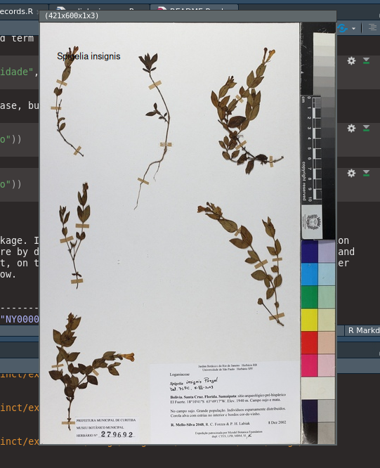

<!-- README.md is generated from README.Rmd. Please edit that file -->

```{r, include = FALSE}
knitr::opts_chunk$set(
  collapse = TRUE,
  comment = "#>",
  fig.path = "man/figures/README-",
  out.width = "100%"
)
```

# *sp*linkr

<!-- badges: start -->
[](https://www.tidyverse.org/lifecycle/#experimental)
<!-- badges: end -->

The purpose of this package is to connect `R` environment to *species*Link, a collaborative network that includes the participation of hundreds of biological collections in Brazil and abroad, whose main objective is to give access to anyone interested in the data about the records held by collections, and observation data ([cria.org.br](http://www.cria.org.br/projetos)).

This package uses CRIA *species*Link API v.0.1 beta ([CRIA](https://api.splink.org.br/help/)) as source of the data and the *Exsiccatae* service ([INCT-HVFF](http://reflora-cdc.cria.org.br/inct/exsiccatae)) as images source.

## Installation

You can install the released version of `splinkr` from [GitHub](https://github.org/cadubio/splinkr) with:

```{r install, eval=FALSE, include=TRUE}
if (!require(devtools)) install.packages("devtools")
devtools::install_github("cadubio/splinkr")
```

## Usage

There are tree functions in package: `splinkr_datasets`*,* `splinkr_records` and `splinkr_images`.

```{r load-pkg}
# load package
library(splinkr)
```

### Function `splinkr_datasets()`

The function `splinkr_datasets()` with no arguments returns a `tibble` with all datasets of biological collections included in *species*Link network.

```{r splinkr_datasets}
splinkr_datasets()
```

Pass one term to `filter` argument filtering all variables (columns) of datasets.

```{r filter-one-term}
splinkr_datasets(filter = "universidade")
```

If more than one term is passed to `filter`, intersection filtering is performed, that is, the search with second term is only performed on subset obtained from filtering with first term. The search with third term is only done in subset of second term and so on...

```{r filter-more}
splinkr_datasets(filter = c("universidade", "herbário", "brasil"))
```

Note that filtering do not matches case, but matches with portuguese diacritical signs.

```{r filter-dont-match}
splinkr_datasets(filter = c("Herbario"))
```

```{r filter-match}
splinkr_datasets(filter = c("herbário"))
```

### Function `splinkr_records()`

This is the main function of the package. It provides a search engine for the more than 14 million *species*Link records. All arguments are `NULL` by default. Arguments `scientificName`, `barcode` and `catalogNumber` are mutualy excludent, on the other hand, one of the them can mixed with all other arguments. See list of arguments below. 

| Argument | Options | Example |
| ---------|-------------------|----------------------------------------------|
| barcode  | character vector  | `c("NY00000001", "FPS00257", "FCM00096")` |
| basisOfRecord | PreservedSpecimen, LivingSpecimen, FossilSpecimen, HumanObservation, MachineObservation, MaterialSample | c("PreservedSpecimen") |
| collectionCode  |	character vector |	`c("FIOCRUZ-CEIOC", "UEC", "HUEFS")` |
| catalogNumber	| character vector, embranco, nãobranco | 	`c("435643", "P234576", "embranco)` |
| collector     |	collector name |	`c("Siqueira", "Almeida F")` |
| collectorNumber |	character vector	| `c("125", "1897A")` |
| yearCollected	| four-digits year	| `c(1887, 1897, 2000)`|
| identifiedBy |	character vector	| `c("Siqueira CE")`|
| yearIdentified | four-digits year |	`c(1997, 2015)`|
| kingdom	| character vector |	`c("Plantae", "Animalia", "Fungi")`|
| phylum  |	character vector	| `c("Arthropoda", "Nematoda")` |
| class	  | character vector	| `c("Reptilia", "Amphibia")`|
| order	  | character vector	| `c("Crocodilia", "Anura")` |
| family  |	character vector	| `c("Bromeliaceae", "Apidae")` |
| genus	  | character vector |	`c("Tabebuia", "Bacillus", "Hoplias")` |
| scientificName |	character vector |	`c("Bothrops neuwiedii matogrossensis", "Leishmania braziliensis")` |
| typus |	NULL, yes | "yes" |	
| country	| character vector |	`c("Brasil", "Argentina")` |
| stateProvince	| character vector |	`c("SP", "Santa Catarina", "MT")` |
| county |	character vector |	`c("São José", "Anitápolis", "Rio Branco")` |
| locality |	character vector	| `c("pedra branca", "fazendinha")` | 
| maxRecords |	character vector | "5" |	
| redlist |	NULL, yes | "yes"	|

<!-- | notes |	character vector	| `c("floresta ombrófila", "flores magentas")` | -->

Code examples

```{r records example}
# scientific name query 
splinkr_records(scientificName = "Dyckia encholirioides var. rubra")


splinkr_records(scientificName = c("Acianthera saundersiana", "Anathallis microphyta"),
                collector = "Siqueira")

# Returns only type species
splinkr_records(scientificName = c("Campylocentrum insulare", "Acianthera saundersiana"), collectionCode = "FLOR", typus = "yes")
```


A large number of scientific names may be passed but the return may take a while, so it possible limit the number of records to return with `maxrecords` argument

```{r records beware, eval=FALSE, include=TRUE}
# Vector names
nomes <- c("Abarema turbinata", "Comolia villosa", "Stylosanthes campestris", 
"Vochysia floribunda", "Eugenia platyphylla", "Chaetocalyx acutifolia", 
"Actinocephalus ochrocephalus", "Cicuta douglasii", "Annona senegalensis", 
"Hexasepalum radula", "Trichosalpinx dura", "Allophylus sericeus", 
"Microlicia juniperina", "Campomanesia pubescens", "Luxemburgia ciliosa", 
"Dalechampia humilis", "Croton heliotropiifolius", "Senna alata", 
"Ipomoea dichotoma", "Arundo donax")

# Note that maxrecords must be passed as a character (quoted number)
splinkr_records(scientificName = nomes, maxrecords = "20")
```


### Function `splinkr_images()`

The goal of this function is to provide a relatively quick way to view images of collections. According ([cria.org.br](http://www.cria.org.br/projetos)) there are more than three million records with images. Package [imager](https://CRAN.R-project.org/package=imager) is used to display this images. 

In the future an integration with [imageJ](https://imagej.nih.gov/) may be provided to download and examine images from specimen records.
```{r imagecode, eval=FALSE, include=TRUE}
# Display image by `imagecode`
splinkr_images(imagecode = c("FLOR0037759", "UEC190851", "FURB53840"))

# Display image by `scientificName`
splinkr_images(scientificName = c("Spigelia insignis", "Anathallis kleinii"))
```

```{r echo=FALSE, fig.align='center', fig.cap='Example of display function from package imager', out.width='90%'}
knitr::include_graphics('images/imager-display.png')
```

```{r echo=FALSE, fig.align='center', fig.cap='Example display function from package imager', out.width='60%'}

```


# Combining functions

The results of `splinkr_records` can be filtered and passed to `splinkr_images` to display images.
```{r combining, eval=FALSE, include=TRUE}
# Load package dplyr
library(dplyr)

# View images of genus 'Campylocentrum' from UPCB herbarium
splinkr_records(scientificName = "Campylocentrum", collectionCode = "UPCB") %>% 
  select(imagecode) %>% # filtering results
  splinkr_images(imagecode = .)
```

# Data and image sources

CRIA, Centro de Referência em Informação Ambiental. speciesLink API v.0.1 beta. ([api.splink.org.br](https://api.splink.org.br/help)), accessed 5.10.2020.

INCT-HVFF, Herbário Virtual da Flora e dos Fungos. ([reflora-cdc.cria.org.br/inct/exsiccatae](http://reflora-cdc.cria.org.br/inct/exsiccatae)), accessed 5.10.2020.


## Packages used in this project

Duncan Temple Lang (2020). XML: Tools for Parsing and Generating XML Within R and S-Plus. R
  package version 3.99-0.5. ([CRAN](https://CRAN.R-project.org/package=XML))

Hadley Wickham, Romain François, Lionel Henry and Kirill Müller (2020). `dplyr`: A Grammar of Data
  Manipulation. R package version 1.0.2. ([CRAN](https://CRAN.R-project.org/package=dplyr))

Hadley Wickham, Jim Hester and Jeroen Ooms (2020). `xml2`: Parse XML. R package version 1.3.2. ([CRAN](https://CRAN.R-project.org/package=xml2))
  
Kirill Müller and Hadley Wickham (2020). `tibble`: Simple Data Frames. R package version
  3.0.3. ([CRAN](https://CRAN.R-project.org/package=tibble))
  
Lionel Henry and Hadley Wickham (2020). `purrr`: Functional Programming Tools. R package version
  0.3.4. ([CRAN](https://CRAN.R-project.org/package=purrr))
  
Simon Barthelme (2020). `imager`: Image Processing Library Based on 'CImg'. R package version
  0.42.3. ([CRAN](https://CRAN.R-project.org/package=imager))
  
Stefan Milton Bache and Hadley Wickham (2014). `magrittr`: A Forward-Pipe Operator for R. R
  package version 1.5. ([CRAN](https://CRAN.R-project.org/package=magrittr))


