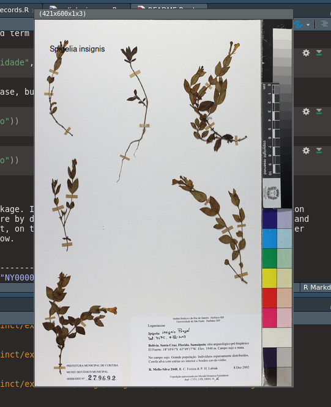

<!-- README.md is generated from README.Rmd. Please edit that file -->

*sp*linkr
=========

<!-- badges: start -->

<!-- badges: end -->

The purpose of this package is to connect `R` environment to
*species*Link, a collaborative network that includes the participation
of hundreds of biological collections in Brazil and abroad, whose main
objective is to give access to anyone interested in the data about the
records held by collections, and observation data
([cria.org.br](http://www.cria.org.br/projetos)).

This package uses CRIA *species*Link API v.0.1 beta
([CRIA](https://api.splink.org.br/help/)) as source of the data and the
*Exsiccatae* service
([INCT-HVFF](http://reflora-cdc.cria.org.br/inct/exsiccatae)) as images
source.

Installation
------------

You can install the released version of `splinkr` from
[GitHub](https://github.org/cadubio/splinkr) with:

    if (!require(devtools)) install.packages("devtools")
    devtools::install_github("cadubio/splinkr")

Usage
-----

There are tree functions in package: `splinkr_datasets`*,*
`splinkr_records` and `splinkr_images`.

    # load package
    library(splinkr)

### Function `splinkr_datasets()`

The function `splinkr_datasets()` with no arguments returns a `tibble`
with all datasets of biological collections included in *species*Link
network.

    splinkr_datasets()
    #> # A tibble: 529 x 9
    #>    collectionCode collectionName institutionCode institutionName scope
    #>    <chr>          <chr>          <chr>           <chr>           <chr>
    #>  1 AcariESALQ     Coleção de Ác… USP             Universidade d… anim…
    #>  2 ALCB           Herbário Alex… UFBA            Universidade F… plan…
    #>  3 AMNH-Bee       Collaborative… AMNH            American Museu… anim…
    #>  4 ANSP-Ichthyol… The Academy o… ANSP            The Academy of… anim…
    #>  5 Aranhas-Solob… Coleção de Ar… UFPR            Universidade F… anim…
    #>  6 ARAR           Coleção Aracn… UPF             Universidade d… anim…
    #>  7 ASE            Herbário da U… UFS             Universidade F… plan…
    #>  8 ASU-Lichen     Arizona State… ASU             Arizona State … plan…
    #>  9 ASU-Plants     Arizona State… ASU             Arizona State … plan…
    #> 10 B              Herbarium Ber… FU-Berlin       Freie Universi… plan…
    #> # … with 519 more rows, and 4 more variables: numberOfRecords <chr>,
    #> #   location <chr>, keywords_pt <chr>, keywords_en <chr>

Pass one term to `filter` argument filtering all variables (columns) of
datasets.

    splinkr_datasets(filter = "universidade")
    #> # A tibble: 326 x 9
    #>    collectionCode collectionName institutionCode institutionName scope
    #>    <chr>          <chr>          <chr>           <chr>           <chr>
    #>  1 AcariESALQ     Coleção de Ác… USP             Universidade d… anim…
    #>  2 ALCB           Herbário Alex… UFBA            Universidade F… plan…
    #>  3 Aranhas-Solob… Coleção de Ar… UFPR            Universidade F… anim…
    #>  4 ARAR           Coleção Aracn… UPF             Universidade d… anim…
    #>  5 ASE            Herbário da U… UFS             Universidade F… plan…
    #>  6 BHCB           Herbário da U… UFMG            Universidade F… plan…
    #>  7 BHCB-Bryophyta Herbário da U… UFMG            Universidade F… plan…
    #>  8 BHCB-SL        Herbário da U… UFMG            Universidade F… plan…
    #>  9 BMA            Herbário Mara… UFMA            Universidade F… plan…
    #> 10 BOTU           Herbário Irin… UNESP           Universidade E… plan…
    #> # … with 316 more rows, and 4 more variables: numberOfRecords <chr>,
    #> #   location <chr>, keywords_pt <chr>, keywords_en <chr>

If more than one term is passed to `filter`, intersection filtering is
performed, that is, the search with second term is only performed on
subset obtained from filtering with first term. The search with third
term is only done in subset of second term and so on…

    splinkr_datasets(filter = c("universidade", "herbário", "brasil"))
    #> # A tibble: 135 x 9
    #>    collectionCode collectionName institutionCode institutionName scope
    #>    <chr>          <chr>          <chr>           <chr>           <chr>
    #>  1 ALCB           Herbário Alex… UFBA            Universidade F… plan…
    #>  2 ASE            Herbário da U… UFS             Universidade F… plan…
    #>  3 BHCB           Herbário da U… UFMG            Universidade F… plan…
    #>  4 BHCB-Bryophyta Herbário da U… UFMG            Universidade F… plan…
    #>  5 BHCB-SL        Herbário da U… UFMG            Universidade F… plan…
    #>  6 BMA            Herbário Mara… UFMA            Universidade F… plan…
    #>  7 BOTU           Herbário Irin… UNESP           Universidade E… plan…
    #>  8 BOTU-Fungi     Herbário Irin… UNESP           Universidade E… plan…
    #>  9 CESJ           Herbário Leop… UFJF            Universidade F… plan…
    #> 10 CGMS           Herbário da F… UFMS            Universidade F… plan…
    #> # … with 125 more rows, and 4 more variables: numberOfRecords <chr>,
    #> #   location <chr>, keywords_pt <chr>, keywords_en <chr>

Note that filtering do not matches case, but matches with portuguese
diacritical signs.

    splinkr_datasets(filter = c("Herbario"))
    #> # A tibble: 3 x 9
    #>   collectionCode collectionName institutionCode institutionName scope
    #>   <chr>          <chr>          <chr>           <chr>           <chr>
    #> 1 HJ             Herbario Jata… UFJ             Universidade F… plan…
    #> 2 HUEFS          Herbario da U… UEFS            Universidade E… plan…
    #> 3 MBML-Herbario  Herbário Mell… INMA            Instituto Naci… plan…
    #> # … with 4 more variables: numberOfRecords <chr>, location <chr>,
    #> #   keywords_pt <chr>, keywords_en <chr>

    splinkr_datasets(filter = c("herbário"))
    #> # A tibble: 203 x 9
    #>    collectionCode collectionName institutionCode institutionName scope
    #>    <chr>          <chr>          <chr>           <chr>           <chr>
    #>  1 ALCB           Herbário Alex… UFBA            Universidade F… plan…
    #>  2 ASE            Herbário da U… UFS             Universidade F… plan…
    #>  3 ASU-Plants     Arizona State… ASU             Arizona State … plan…
    #>  4 B              Herbarium Ber… FU-Berlin       Freie Universi… plan…
    #>  5 BAH            Herbário Antô… EBDA            Empresa Baiana… plan…
    #>  6 BHCB           Herbário da U… UFMG            Universidade F… plan…
    #>  7 BHCB-Bryophyta Herbário da U… UFMG            Universidade F… plan…
    #>  8 BHCB-SL        Herbário da U… UFMG            Universidade F… plan…
    #>  9 BHZB           Herbário do J… FZB-BH          Fundação Zoo-B… plan…
    #> 10 BLA            Brazilian Lab… FEPAGRO         Fundação Estad… plan…
    #> # … with 193 more rows, and 4 more variables: numberOfRecords <chr>,
    #> #   location <chr>, keywords_pt <chr>, keywords_en <chr>

### Function `splinkr_records()`

This is the main function of the package. It provides a search engine
for the more than 14 million *species*Link records. All arguments are
`NULL` by default. Arguments `scientificName`, `barcode` and
`catalogNumber` are mutualy excludent, on the other hand, one of the
them can mixed with all other arguments. See list of arguments below.

| Argument        | Options                                                                                                 | Example                                                             |
|-----------------|---------------------------------------------------------------------------------------------------------|---------------------------------------------------------------------|
| barcode         | character vector                                                                                        | `c("NY00000001", "FPS00257", "FCM00096")`                           |
| basisOfRecord   | PreservedSpecimen, LivingSpecimen, FossilSpecimen, HumanObservation, MachineObservation, MaterialSample | c(“PreservedSpecimen”)                                              |
| collectionCode  | character vector                                                                                        | `c("FIOCRUZ-CEIOC", "UEC", "HUEFS")`                                |
| catalogNumber   | character vector, embranco, nãobranco                                                                   | `c("435643", "P234576", "embranco)`                                 |
| collector       | collector name                                                                                          | `c("Siqueira", "Almeida F")`                                        |
| collectorNumber | character vector                                                                                        | `c("125", "1897A")`                                                 |
| yearCollected   | four-digits year                                                                                        | `c(1887, 1897, 2000)`                                               |
| identifiedBy    | character vector                                                                                        | `c("Siqueira CE")`                                                  |
| yearIdentified  | four-digits year                                                                                        | `c(1997, 2015)`                                                     |
| kingdom         | character vector                                                                                        | `c("Plantae", "Animalia", "Fungi")`                                 |
| phylum          | character vector                                                                                        | `c("Arthropoda", "Nematoda")`                                       |
| class           | character vector                                                                                        | `c("Reptilia", "Amphibia")`                                         |
| order           | character vector                                                                                        | `c("Crocodilia", "Anura")`                                          |
| family          | character vector                                                                                        | `c("Bromeliaceae", "Apidae")`                                       |
| genus           | character vector                                                                                        | `c("Tabebuia", "Bacillus", "Hoplias")`                              |
| scientificName  | character vector                                                                                        | `c("Bothrops neuwiedii matogrossensis", "Leishmania braziliensis")` |
| typus           | NULL, yes                                                                                               | “yes”                                                               |
| country         | character vector                                                                                        | `c("Brasil", "Argentina")`                                          |
| stateProvince   | character vector                                                                                        | `c("SP", "Santa Catarina", "MT")`                                   |
| county          | character vector                                                                                        | `c("São José", "Anitápolis", "Rio Branco")`                         |
| locality        | character vector                                                                                        | `c("pedra branca", "fazendinha")`                                   |
| maxRecords      | character vector                                                                                        | “5”                                                                 |
| redlist         | NULL, yes                                                                                               | “yes”                                                               |

<!-- | notes |  character vector    | `c("floresta ombrófila", "flores magentas")` | -->

Code examples

    # scientific name query 
    splinkr_records(scientificName = "Dyckia encholirioides var. rubra")
    #> Warning in names(x) == varNames: comprimento do objeto maior não é múltiplo do
    #> comprimento do objeto menor
    #> # A tibble: 2 x 25
    #>   modified institutionCode collectionCode catalogNumber basisOfRecord kingdom
    #>   <chr>    <chr>           <chr>          <chr>         <chr>         <chr>  
    #> 1 2016-02… BGBM            B              B 10 0248907  S             Plantae
    #> 2 2018-06… MO              MOBOT          2452813       PreservedSpe… Plantae
    #> # … with 19 more variables: family <chr>, genus <chr>, specificEpithet <chr>,
    #> #   infraspecificEpithet <chr>, scientificName <chr>,
    #> #   scientificNameAuthorship <chr>, typeStatus <chr>, recordedBy <chr>,
    #> #   recordNumber <chr>, continentOcean <chr>, country <chr>, locality <chr>,
    #> #   occurrenceRemarks <chr>, barcode <chr>, imagecode <chr>, year <chr>,
    #> #   month <chr>, day <chr>, stateProvince <chr>

    splinkr_records(scientificName = c("Acianthera saundersiana", "Anathallis microphyta"),
                    collector = "Siqueira")
    #> # A tibble: 12 x 36
    #>    modified institutionCode collectionCode catalogNumber basisOfRecord kingdom
    #>    <chr>    <chr>           <chr>          <chr>         <chr>         <chr>  
    #>  1 2020-08… UFSC            FLOR           37752         PreservedSpe… Plantae
    #>  2 2020-08… UFSC            FLOR           37751         PreservedSpe… Plantae
    #>  3 2020-08… UFSC            FLOR           50339         PreservedSpe… Plantae
    #>  4 2020-08… UFSC            FLOR           37753         PreservedSpe… Plantae
    #>  5 2020-08… UFSC            FLOR           37802         PreservedSpe… Plantae
    #>  6 2020-08… UFSC            FLOR           37804         PreservedSpe… Plantae
    #>  7 2020-08… UFSC            FLOR           37759         PreservedSpe… Plantae
    #>  8 2020-08… UFSC            FLOR           37758         PreservedSpe… Plantae
    #>  9 2020-08… UFSC            FLOR           50341         PreservedSpe… Plantae
    #> 10 2020-08… UFSC            FLOR           50761         PreservedSpe… Plantae
    #> 11 2020-08… UFSC            FLOR           51722         PreservedSpe… Plantae
    #> 12 2020-08… UFSC            FLOR           59299         PreservedSpe… Plantae
    #> # … with 30 more variables: order <chr>, family <chr>, genus <chr>,
    #> #   specificEpithet <chr>, scientificName <chr>,
    #> #   scientificNameAuthorship <chr>, identifiedBy <chr>, recordedBy <chr>,
    #> #   recordNumber <chr>, year <chr>, month <chr>, day <chr>, country <chr>,
    #> #   stateProvince <chr>, county <chr>, locality <chr>, decimalLongitude <chr>,
    #> #   decimalLatitude <chr>, verbatimLongitude <chr>, verbatimLatitude <chr>,
    #> #   minimumElevationInMeters <chr>, maximumElevationInMeters <chr>,
    #> #   occurrenceRemarks <chr>, barcode <chr>, yearIdentified <chr>,
    #> #   monthIdentified <chr>, dayIdentified <chr>, coordinatePrecision <chr>,
    #> #   geoFlag <chr>, imagecode <chr>

    # Returns only type species
    splinkr_records(scientificName = c("Campylocentrum insulare", "Acianthera saundersiana"), collectionCode = "FLOR", typus = "yes")
    #> # A tibble: 1 x 31
    #>   modified institutionCode collectionCode catalogNumber basisOfRecord kingdom
    #>   <chr>    <chr>           <chr>          <chr>         <chr>         <chr>  
    #> 1 2020-08… UFSC            FLOR           40000         PreservedSpe… Plantae
    #> # … with 25 more variables: order <chr>, family <chr>, genus <chr>,
    #> #   specificEpithet <chr>, scientificName <chr>,
    #> #   scientificNameAuthorship <chr>, identifiedBy <chr>, yearIdentified <chr>,
    #> #   typeStatus <chr>, recordedBy <chr>, recordNumber <chr>, year <chr>,
    #> #   month <chr>, country <chr>, stateProvince <chr>, county <chr>,
    #> #   locality <chr>, decimalLongitude <chr>, decimalLatitude <chr>,
    #> #   verbatimLongitude <chr>, verbatimLatitude <chr>,
    #> #   minimumElevationInMeters <chr>, maximumElevationInMeters <chr>,
    #> #   occurrenceRemarks <chr>, barcode <chr>

A large number of scientific names may be passed but the return may take
a while, so it possible limit the number of records to return with
`maxrecords` argument

    # Vector names
    nomes <- c("Abarema turbinata", "Comolia villosa", "Stylosanthes campestris", 
    "Vochysia floribunda", "Eugenia platyphylla", "Chaetocalyx acutifolia", 
    "Actinocephalus ochrocephalus", "Cicuta douglasii", "Annona senegalensis", 
    "Hexasepalum radula", "Trichosalpinx dura", "Allophylus sericeus", 
    "Microlicia juniperina", "Campomanesia pubescens", "Luxemburgia ciliosa", 
    "Dalechampia humilis", "Croton heliotropiifolius", "Senna alata", 
    "Ipomoea dichotoma", "Arundo donax")

    # Note that maxrecords must be passed as a character (quoted number)
    splinkr_records(scientificName = nomes, maxrecords = "20")

### Function `splinkr_images()`

The goal of this function is to provide a relatively quick way to view
images of collections. According
([cria.org.br](http://www.cria.org.br/projetos)) there are more than
three million records with images. Package
[imager](https://CRAN.R-project.org/package=imager) is used to display
this images.

In the future an integration with [imageJ](https://imagej.nih.gov/) may
be provided to download and examine images from specimen records.

    # Display image by `imagecode`
    splinkr_images(imagecode = c("FLOR0037759", "UEC190851", "FURB53840"))

    # Display image by `scientificName`
    splinkr_images(scientificName = c("Spigelia insignis", "Anathallis kleinii"))

Example of display function from package imager

Example display function from package imager

Using pipe
==========

The results of `splinkr_records` can be filtered and passed via `%>%`
(pipe) to `splinkr_images` to display images.

    # Load package dplyr
    library(dplyr)

    # View images of genus 'Campylocentrum' from UPCB herbarium
    splinkr_records(scientificName = "Campylocentrum", collectionCode = "UPCB") %>% 
      select(imagecode) %>% # filtering results
      splinkr_images(imagecode = .)

Data and image sources
======================

CRIA, Centro de Referência em Informação Ambiental. speciesLink API
v.0.1 beta. ([api.splink.org.br](https://api.splink.org.br/help)),
accessed 5.10.2020.

INCT-HVFF, Herbário Virtual da Flora e dos Fungos.
([reflora-cdc.cria.org.br/inct/exsiccatae](http://reflora-cdc.cria.org.br/inct/exsiccatae)),
accessed 5.10.2020.

Packages used in this project
-----------------------------

Duncan Temple Lang (2020). XML: Tools for Parsing and Generating XML
Within R and S-Plus. R package version 3.99-0.5.
([CRAN](https://CRAN.R-project.org/package=XML))

Hadley Wickham, Romain François, Lionel Henry and Kirill Müller (2020).
`dplyr`: A Grammar of Data Manipulation. R package version 1.0.2.
([CRAN](https://CRAN.R-project.org/package=dplyr))

Hadley Wickham, Jim Hester and Jeroen Ooms (2020). `xml2`: Parse XML. R
package version 1.3.2. ([CRAN](https://CRAN.R-project.org/package=xml2))

Kirill Müller and Hadley Wickham (2020). `tibble`: Simple Data Frames. R
package version 3.0.3.
([CRAN](https://CRAN.R-project.org/package=tibble))

Lionel Henry and Hadley Wickham (2020). `purrr`: Functional Programming
Tools. R package version 0.3.4.
([CRAN](https://CRAN.R-project.org/package=purrr))

Simon Barthelme (2020). `imager`: Image Processing Library Based on
‘CImg’. R package version 0.42.3.
([CRAN](https://CRAN.R-project.org/package=imager))

Stefan Milton Bache and Hadley Wickham (2014). `magrittr`: A
Forward-Pipe Operator for R. R package version 1.5.
([CRAN](https://CRAN.R-project.org/package=magrittr))
